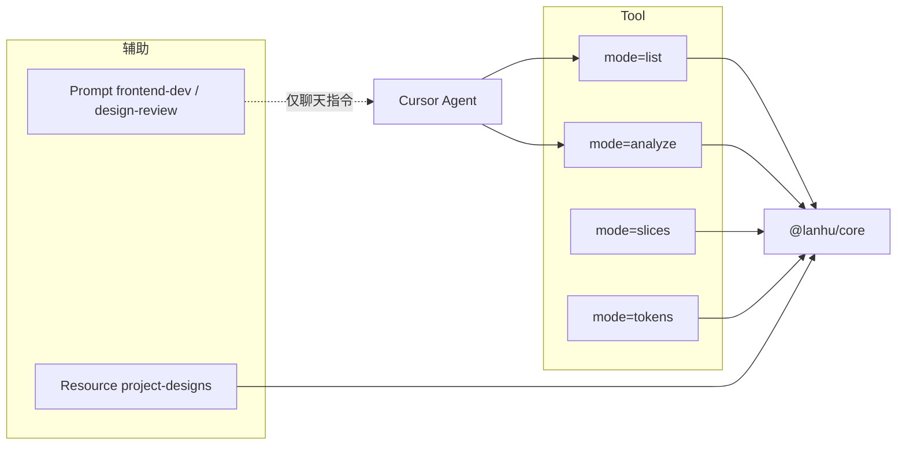

# MCP 设计稿能力 — 方案定稿

> 本文档汇总 lanhu-node 设计稿 MCP 的讨论结论与实现约定。  
> 对照实现：`packages/lanhu-core`、`mcp/`、`server-nest`。  
> 最后更新：2026-07-22

---

## 1. 定稿结论

**设计稿阶段采用：1 个 Tool + 4 个 `mode`，不拆成 4 个独立 Tool。**

| 层级 | 选型 |
|------|------|
| 主 Tool | `lanhu_design` |
| mode | `list` \| `analyze` \| `slices` \| `tokens` |
| 辅助 | Resource `project-designs`、单稿 `design`；Prompt `frontend-dev` / `design-review` |
| 业务实现 | 薄壳调 `@lanhu/core`，不复制 `server-nest` 分步逻辑 |
| 已实现 Tool | `lanhu_design`（设计稿）、`lanhu_page`（原型） |
| 尚未实现 | `lanhu_resolve_invite_link`、留言板（say 系列） |

---

## 2. 为何 1 Tool + 4 Mode

### 2.1 不拆 4 Tool 的理由

1. **与 `@lanhu/core` 一致**：`listDesigns` / `analyzeDesign` / `getSlices` 已是一条流水线，MCP 只做参数映射与返回格式化。
2. **与 `CONTEXT.md` 方向一致**：一个设计稿入口，语义清晰。
3. **维护成本**：`url`、选稿、`detailDetach` vs `stage`、`tid` 规则只写一份 tool description。
4. **HTTP 调试台分工**：`server-nest` 分步路由给人点按钮；MCP 一个入口给 Agent，不必 1:1 映射十个 HTTP 路由。

### 2.2 从 AI 模型角度的取舍

| 错误类型 | 1 tool + mode | 4 个独立 tool |
|----------|---------------|---------------|
| 选错能力（list / analyze / slices） | **更少**（只有一个设计 tool） | 更多（工具名相近） |
| 漏写 `mode`、误走默认 analyze | 有风险 | 无 mode 字段 |
| 漏 `design_names` | 相同（靠服务端校验） | 相同 |
| 没先 list 就 analyze | 相同（靠 description + Resource） | 相同 |

**结论**：整体出错率 **1 tool + mode 更低**；通过 **强制显式 `mode`（或清晰默认策略）+ `design_names` 校验 + Resource 辅助 list** 降低漏参风险。

---

## 3. `lanhu_design` 参数约定（NODE 目标 schema）

```typescript
lanhu_design({
  url: string,                                          // 必填，stage 或 detailDetach
  mode?: "list" | "analyze" | "slices" | "tokens",      // 默认 "analyze"
  design_names?: string | string[],                     // 有条件必填；支持 "all" / 序号 / id / name；见 §3.2
  include?: ("html" | "image" | "tokens" | "layout" | "layers")[],  // 仅 analyze；见 §5
  withSlices?: boolean,                                 // 可选：analyze 时附带 B 套切图元数据（对齐 HTTP withSlices）
})
```

### 3.1 与 HTTP 调试台映射

| MCP `lanhu_design` | NODE HTTP | 说明 |
|--------------------|-----------|------|
| `mode=list` | `POST /api/designs/list` | 响应含全量 `designs[]` |
| `mode=analyze` | `POST /api/designs/analyze` | 内嵌 list 选稿，响应**仅单条** `design` + 分析产物 |
| `mode=slices` | `POST /api/designs/slices` | B 套切图元数据 |
| `mode=tokens` | （无独立 HTTP） | 仅 sketch + `extractDesignTokens` |

### 3.2 MCP 与 HTTP 的选稿约定

| 项 | 调试台 HTTP | MCP |
|----|-------------|-----|
| URL 含 `image_id` | 自动选该稿 | **同样自动选**（可省略 `design_names`） |
| list 仅 1 张 | 自动选 | **同样自动选** |
| stage 多稿、未传画板 | 默认 `designs[0]` | **报错** + `available_designs`（不默默选第一张） |
| 显式 `design_names` | 按 selector 选 | 优先于 URL `image_id` |
| 全量列表 | 仅 `list` 或先点 project/images | 仅 `mode=list` 或 Resource |
| `include` | 无，analyze 默认拉较全 | 应有，控制输出体积 |

---

## 4. 四个 `mode` 行为

```text
lanhu_design(url, mode, design_names?, include?)
    │
    ├─ parseLanhuUrl(url)
    ├─ listDesigns(client, url)     ← 所有 mode 在选稿前都会内嵌 list（list 模式直接返回）
    │
    ├─ mode === "list"
    │     → 返回全项目 designs[]（不按 URL image_id 过滤 stage 全量）
    │
    ├─ mode === "slices"
    │     → design_names 可省略（见 §3.2）→ pickDesign → getSlices()
    │
    ├─ mode === "tokens"
    │     → design_names 可省略（见 §3.2）→ getSketchJson → extractDesignTokens（轻量，无 HTML）
    │
    └─ mode === "analyze"
          → design_names 可省略（见 §3.2）→ pickDesign → Schema/Sketch/HTML/tokens/…
          → 由 include 控制输出（§5）
```

### 4.1 `list`

- **不需要** `design_names`。
- 返回：`projectName`、`totalDesigns`、`designs[]`（index / id / name / width / height）。
- **不能**被 `mode=analyze` 替代：analyze 响应不含全量列表。

### 4.2 `analyze`

- **`design_names` 可省略**当 URL 含 `image_id`，或 list 仅 1 张；stage 多稿时必填。
- 显式 `design_names` 优先于 URL `image_id`（允许 override）。
- 主路径：Schema → HTML；失败或 `detailDetach` → Sketch fallback。
- 支持 `design_names: "all"` 多稿并发（建议上限 5）。

### 4.3 `slices`

- **`design_names` 可省略**条件同 analyze（单稿为主；传 `"all"` 时 slices 模式仅处理第一张）。
- 调用 `getSlices()`，返回切图列表、`scale_urls`、位置等。
- **不能**用 `analyze` + `include: slices` 代替（`include` 中的 `slices` 指 A 套 mapping，与 B 套 `mode=slices` 不同）。
- **下载行为（定稿，已实现）**：见 [`MCP_SLICES.md`](./MCP_SLICES.md)——B 套切图落盘、`slice_format` / `slice_scale` / `slice_names` / `output_dir`。

### 4.4 `tokens`

- **`design_names` 可省略**条件同 analyze。
- 仅 `getSketchJson` + `extractDesignTokens`。
- 与 `analyze` + `include: ["tokens"]` **能力重叠**，但本 mode 更轻、返回更干净；适合「只要 tokens、不要 HTML/封面」。

---

## 5. `include` 仅属于 `analyze`

以 `packages/lanhu-core/src/pipeline/analyze-include.ts` 为准：

```text
默认 include = ["html", "tokens", "layers", "layout", "image", "slices"]
```

> 实际默认以 core 代码为准；MCP schema description 须与实现一致。

| include | analyze 是否处理 | 行为 |
|---------|------------------|------|
| `html` | ✅ | Schema→HTML；失败 Sketch fallback |
| `image` | ✅ | 封面 PNG base64 |
| `tokens` | ✅ | Sketch + `extractDesignTokens` |
| `layers` | ✅ | Sketch + `extractLayerTree` |
| `layout` | ✅ | Schema 成功时 `layoutSummary`（依赖 html 路径） |
| `slices` | ✅ | A 套 mapping（`convert.after.mapping`）；B 套切图请用 `mode=slices` 或 `withSlices: true` |

**易错**：

- `include: ["layout"]` 且无 `html` → 不跑 Schema，layout 可能为空。
- `include: ["slices"]` → A 套 mapping；B 套请用 `mode=slices`。

**`analyze` 未覆盖的 mode**：

| mode | 能否用 analyze 代替 |
|------|---------------------|
| `list` | ❌ |
| `slices` | ❌（B 套请用 `mode=slices`） |
| `tokens` | ⚠️ 部分重叠；专用 `mode=tokens` 更轻 |

---

## 6. list 与 analyze 的职责分工（易混点）

| 问题 | 结论 |
|------|------|
| analyze 服务端会不会 list？ | **会**，内存里 `listDesigns` + `pickDesign` |
| analyze 响应会不会带全量 designs？ | **不会**，仅当前分析的 `design` |
| 调试台为何「一键 analyze」后选稿区只有 1 张？ | **前端** `applyAnalyzeResult` 只 `prependDesign` 一张；未调 `project/images` 则 store 无全列表（**调试台 UX，非 MCP 契约**） |
| Agent 如何拿全列表？ | `mode=list` 或读 Resource `project-designs` |

### 6.1 URL：`stage` vs `detailDetach`

| URL | list 行为 | 选稿 |
|-----|-----------|------|
| `detailDetach` + `image_id` | 单稿，`totalDesigns: 1` | URL 锁定该 id |
| `stage` 仅 `tid` + `pid` | 全项目 `project/images` | 须 `design_names` 或先 list；无 image_id 时 **不**自动锁定当前画布 |

---

## 7. Resource 与 Prompt（非 Tool）

### 7.1 Resource：`project-designs`

| 项 | 说明 |
|----|------|
| URI | `lanhu://project/{pid}/designs?tid={tid}` |
| 行为 | 拼 stage URL → 内部 `listDesigns` → JSON 列表 |
| 与 tool 关系 | 等价于 `lanhu_design(mode=list)` 的只读快捷方式；**不**拉 HTML/Schema |
| 典型用法 | Agent 已知 pid/tid，先读 Resource 发现画板，再 `mode=analyze` |

### 7.2 Prompt：`frontend-dev`

| 项 | 说明 |
|----|------|
| 类型 | MCP Prompt（预置用户消息模板） |
| 作用 | 定任务：**按设计稿像素级生成前端代码**（字体/颜色/间距精确、资源落本地、布局 1:1） |
| 是否拉蓝湖 | **否** |
| 与 tool 关系 | Prompt 定目标后，Agent **仍须**调 `lanhu_design` 拿 HTML/tokens/图 |

### 7.3 Prompt：`design-review`

| 项 | 说明 |
|----|------|
| 作用 | 定任务：**审查设计一致性与可实现性**（字体/色板/间距/圆角/实现风险） |
| 是否拉蓝湖 | **否** |
| 与 `frontend-dev` 区别 | review = 对照检查偏差点；frontend-dev = 从稿 **写出** 代码 |

**Prompt 说明**：已在 `mcp/src/prompts/` 注册；只生成任务话术，**不**自动拉蓝湖数据，Agent 仍须调 `lanhu_design`。

---

## 8. Cursor 中如何传 `mode`

`mode` 是 `lanhu_design` 的普通 JSON 参数，不是 Cursor 单独 UI 开关。Agent 根据用户意图填参，例如：

| 用户意图 | 典型参数 |
|----------|----------|
| 列出所有设计稿 | `{ url, mode: "list" }` |
| 分析 #2 画板 HTML | `{ url, mode: "analyze", design_names: "2", include: ["html"] }` |
| 提取切图 | `{ url, mode: "slices", design_names: "画板名" }` |
| 只要 tokens | `{ url, mode: "tokens", design_names: "1" }` |

建议 tool description 首行写明工作流：

```text
Workflow: mode=list（或读 Resource）→ 确认 design_names → mode=analyze / slices / tokens
```

---

## 9. 推荐 Agent 工作流

```text
1. [可选] lanhu_resolve_invite_link(invite_url)     ← 后期
2. lanhu_design(url, mode=list)
   或读 Resource lanhu://project/{pid}/designs?tid={tid}
3. lanhu_design(url, mode=analyze, design_names=…, include=[…])
4. [可选] lanhu_design(url, mode=slices, design_names=…)
5. [可选] Prompt frontend-dev / design-review        ← 定任务话术，不替代 step 2–4
```



---

## 10. NODE 实现清单（`mcp/` 套壳）

| 步骤 | 内容 |
|------|------|
| 1 | 注册 `lanhu_design`，四 mode 分支调 `@lanhu/core` |
| 2 | `design_names` 在 stage 多稿时必填；缺参返回 `available_designs` 与 `hint` |
| 3 | 实现 `include`（analyze）；默认以 core `analyze-include.ts` 为准 |
| 4 | **不**在 analyze 响应中返回全量 `designs[]` |
| 5 | 注册 Resource `project-designs` |
| 6 | [可选] Prompt `frontend-dev`、`design-review` |
| 7 | [后期] `lanhu_resolve_invite_link`、留言板 |

### 10.1 与 HTTP analyze 的差异（MCP 刻意保留）

| 项 | HTTP analyze | MCP |
|----|--------------|-----|
| 未传画板 | 默认 `designs[0]` | stage 多稿：**报错**；URL 含 `image_id` 或仅 1 张：**自动选** |
| 响应 | 可含 artifacts 落盘信息 | 格式化 MCP content + structuredContent |

---

## 11. 相关文档

| 文档 | 内容 |
|------|------|
| **[`MCP_IMPLEMENTATION.md`](./MCP_IMPLEMENTATION.md)** | **工程实现蓝图**（目录、分期、schema、core 补强） |
| [`CURSOR_MCP.md`](./CURSOR_MCP.md) | Cursor 配置与调用示例 |
| [`CONTEXT.md`](./CONTEXT.md) | monorepo 目标、core 链路、HTTP API |
| `packages/lanhu-core/README.md` | core 模块与 API |

---

## 12. 讨论记录摘要（2026-06）

1. **stage URL 无 image_id**：analyze 内嵌 list 后默认 `designs[0]`（非「最后一张」）；detailDetach 带 image_id 则锁定单稿。
2. **调试台一键 analyze 无全选稿列表**：服务端 analyze 不回填 designs；前端只 `prependDesign` 一张——已在调试台加说明文案。
3. **主流水线与接口区两个「一键 analyze」**：同一 `runAnalyzeFlow`，无行为差异。
4. **MCP tool 数量**：设计稿阶段 **1 tool 4 mode**。
5. **analyze 是否覆盖 list/tokens/slices**：**不覆盖 list 与 B 套 slices**；与 **tokens 部分重叠**。
6. **Prompt 仍须调 tool**：`frontend-dev` / `design-review` 只生成任务消息，不请求蓝湖。
