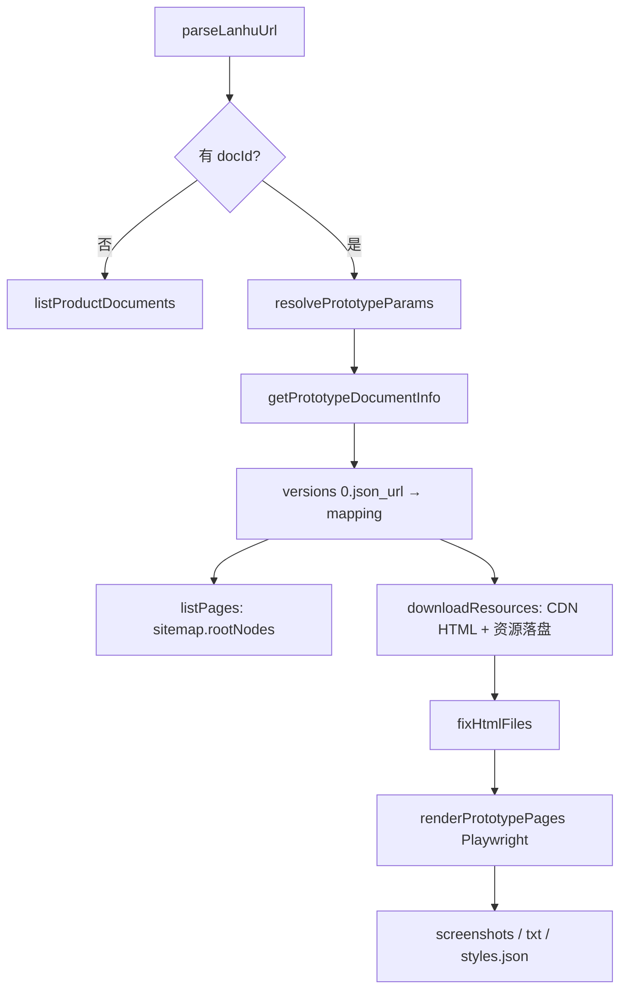
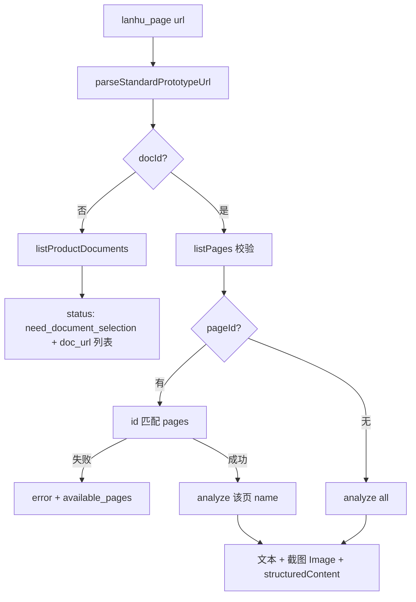

# 蓝湖原型（PRD/Axure）与 MCP 实现说明

本文档基于 `lanhu-node` 原型能力建设过程整理，涵盖 URL 语义、Core 管线、本地缓存目录、调试台与 **MCP `lanhu_page`** 的设计与实现。

---

## 1. 背景与目标

蓝湖有两种主要资源：

| 类型 | 路由 | 用途 |
|------|------|------|
| **原型 / PRD** | `#/item/project/product` | Axure 导出包，需求/交互文档 |
| **UI 设计稿** | `#/item/project/stage` 或 `detailDetach` | 视觉设计稿 |

本项目在 `@lanhu/core` 中实现原型 **下载 → HTML 修复 → Playwright 渲染 → 截图/文本/样式提取**，并通过：

- **server-nest** REST API（调试台）
- **mcp** 包中的 `lanhu_page` 工具（Cursor / MCP Inspector）

对外暴露能力。设计稿走独立的 `lanhu_design`。

原型本质是 **Axure 静态包**：蓝湖将 mapping JSON 与资源挂在 CDN（`axure-file.lanhuapp.com`），本地缓存后由 Playwright 在本地 HTTP 服务中打开 HTML 分析。

---

## 2. URL 参数语义

标准原型链接示例：

```text
https://lanhuapp.com/web/#/item/project/product
  ?tid=2d185eaa-803c-4a3b-8985-c8982d3d83ed
  &pid=f30c9cac-fc1c-42c6-ae01-592938226141
  &docId=077bbf6d-6dd1-4359-836e-7bbf74db2603
  &image_id=077bbf6d-6dd1-4359-836e-7bbf74db2603
  &pageId=06ef22a06ea7453a8886f3a70e7b7e8e
  &versionId=14f77309-636c-4fd7-a7d6-b62c1cc91c63
  &docType=axure
```

### 2.1 层级关系

```text
团队 / 项目
 └── tid + pid          → 哪个「项目」
      └── docId         → 项目里哪「一份」PRD/Axure 文档（整包）
           └── pageId   → 文档内「当前页面」（蓝湖左侧「页面」列表的一项）
                └── *.html  → Axure 实际文件 stem（如 faha-首充活动）
```

### 2.2 参数表

| 参数 | 含义 | 必填 | 说明 |
|------|------|------|------|
| **tid** | 团队 ID | 原型场景必填 | 别名 `teamId` / `team_id` |
| **pid** | 项目 ID | **必填** | 别名 `project_id` |
| **docId** | 文档 ID | 列页/下载/分析必填 | 一份 PRD/原型包的唯一标识 |
| **image_id** | 与 docId 同义 | 可选 | 蓝湖 API 常用参数名；解析时 `docId ?? image_id` |
| **pageId** | 页面节点 ID | 可选 | sitemap 中 `pages[].id`；URL 表示蓝湖 UI 当前选中的页 |
| **versionId** | 文档版本 | 可选 | URL 可带；**下载/截图缓存以 API 返回的 latest version 为准** |
| **docType** | 文档类型 | 可选 | 如 `axure`；目前解析保留，业务未单独分支 |

### 2.3 两种「列表」勿混淆

| 能力 | 所需参数 | 返回内容 |
|------|----------|----------|
| **项目文档列表** `listProductDocuments` | `tid + pid` | 项目下多份 PRD（每份一个 `docId`） |
| **文档内页面列表** `listPages` | `tid + pid + docId` | 一份文档内左侧「页面」树（每项有 `id` / `name` / `filename`） |

无 `docId` 时只能做前者；有 `docId` 后才能列页、下载、分析。

### 2.4 URL 约束（MCP 与后续优化方向）

MCP `lanhu_page` 当前要求：

- 必须以 `https://lanhuapp.com/` 开头
- Hash 路由为 `#/item/project/product`
- 必须含 `tid`、`pid`

**不支持**：仅 hash 片段、纯 query、邀请链 `/invite`（邀请链解析 intentionally 未实现）。

Core 层 `parseLanhuUrl` 仍兼容多种输入格式；MCP 在工具入口额外收紧校验。

---

## 3. Core 架构

### 3.1 模块与职责

| 模块 | 路径 | 职责 |
|------|------|------|
| URL 解析 | `packages/lanhu-core/src/lanhu/parse-url.ts` | `parseLanhuUrl`、`buildPrototypeDocumentUrl`、`resolvePrototypeDocumentUrl` |
| 原型 API | `packages/lanhu-core/src/lanhu/pages.ts` | 列文档、列页、下载、分析编排 |
| HTML 修复 | `packages/lanhu-core/src/transform/fix-html-files.ts` | 修复 Axure 导出 HTML 路径与脚本引用 |
| 浏览器分析 | `packages/lanhu-core/src/transform/page-browser-analyzer.ts` | Playwright 截图 + 浏览器内提取文本/样式 |
| 样式格式化 | `packages/lanhu-core/src/transform/page-design-info-format.ts` | 样式摘要文本 |
| 目录解析 | `packages/lanhu-core/src/persist/data-dir.ts` | `lanhu_prototypes/{pid}/{docId}_{slug}/` + `screenshots/` |

### 3.2 数据流



### 3.3 主要 API 行为

**`listProductDocuments(fetch, teamId, projectId)`**

- 调用 `GET /api/project/product_documents`
- 为每项生成标准 `doc_url`（含 `docId` + `image_id`）

**`listPages(fetch, url)`**

- 需要 URL 中含 `docId`（或通过 `resolvePrototypeDocumentUrl` 补全）
- 读 `versions[0].json_url` → 解析 `sitemap.rootNodes` → `pages[]`

**`downloadResources(fetch, url, outputDir)`**

- 按 §3.4 从 CDN 拉取 mapping 中 **全部** HTML 及关联资源（整包）
- 版本号取 API `versions[0].id`，写入 `.lanhu-page-cache.json`；响应含 `sources`（json_url / 每页 CDN URL）
- 同时落盘 mapping 索引：`.lanhu-project-mapping.json`、`.lanhu-download-sources.json`、`.lanhu-page-mappings/{stem}.json`
- 与 `pageId` 无关

**`analyzePrototypePages(fetch, url, outputDir, pageNames, options)`**

- 内部：`downloadResources` → `listPages` → `fixHtmlFiles` → `renderPrototypePages`
- `pageNames` 为页面 **展示名**、`"all"` 或数组；**不直接读 URL 中的 pageId**（MCP 层负责 pageId → name 映射）

**`pageId` 在 Core 中的现状**

- `parseLanhuUrl` 会解析 `pageId`
- `resolvePrototypeParams` 会返回 `pageId`
- **`pages.ts` 下载/列页/分析流程不使用 URL 中的 pageId**；定位具体页靠 `pageNames` 或 MCP/调试台映射

### 3.4 Axure HTML 获取过程（CDN 路径）

本地落盘的 HTML **不是**根据 `listPages` 的 sitemap 在本地拼接，而是从蓝湖 CDN **按 sign_md5 拉取原包**后再 `fixHtmlFiles` 修补路径。实现集中在 `packages/lanhu-core/src/lanhu/pages.ts` 的 `downloadResources`（列页 `listPages` 只读 sitemap，**不含** CDN 字段）。

#### 3.4.1 三步链路

```text
步骤 1 · 文档版本
  GET https://lanhuapp.com/api/project/image
      ?pid={projectId}&image_id={docId}
  → data.versions[0].id          （version_id，写缓存）
  → data.versions[0].json_url    （项目级 mapping JSON，常在 OSS）

步骤 2 · 项目 Mapping
  GET {json_url}                 （无 JSON 信封，直接是 mapping 对象）
  → pages["劳动节.html"].html.sign_md5
  → pages["劳动节.html"].mapping_md5   （可选，页级 styles/scripts/images）

步骤 3 · Axure CDN
  html_cdn_url = normalizeAssetUrl(sign_md5)
    若 sign_md5 已是 http(s) → 原样使用
    否则 → https://axure-file.lanhuapp.com/{sign_md5}
  GET html_cdn_url → HTML 正文 → 写入 {output_dir}/{htmlFilename}
```

对应 core 函数：

| 步骤 | 函数 |
|------|------|
| 1 | `getPrototypeDocumentInfo` |
| 2 | `fetchJson(fetchImpl, jsonUrl)` |
| 3 | `normalizeAssetUrl` + `fetchText` |

若存在 `mapping_md5`，还会 `GET normalizeAssetUrl(mapping_md5)` 得到页级 mapping，再经 `downloadPageResources` 批量下载 `styles` / `scripts` / `images` 下的资源（同样走 `sign_md5` → CDN）。

#### 3.4.2 与「列页」的差异

| 能力 | 数据来源 | 是否含 `sign_md5` / CDN URL |
|------|----------|------------------------------|
| `listPages` | mapping 的 `sitemap.rootNodes` | ❌ 只有展示名、filename、pageId |
| `downloadResources` | mapping 的 `pages[*].html` | ✅ 拉 CDN 并落盘 |

因此要看 **CDN 上的 HTML 路径**，必须走下载（或调试台「2. 下载资源」触发的同一套解析），不能只看页面列表 Tab。

#### 3.4.3 响应中的 `sources`（调试台可见）

`downloadResources` 返回值 `DownloadResourcesResult` 含 `sources` 字段（**不返回 HTML 正文**，只返回解析出的 URL）：

```json
{
  "status": "downloaded",
  "version_id": "...",
  "output_dir": ".../lanhu_prototypes/{pid}/{docId}_{文档名}/",
  "sources": {
    "document_id": "...",
    "document_name": "劳动节",
    "version_id": "...",
    "json_url": "https://lanhu-axure-file.oss-cn-beijing.aliyuncs.com/....json",
    "pages": [
      {
        "html_filename": "劳动节.html",
        "html_sign_md5": "f30c9cac-..._md5__21896a0b....html",
        "html_cdn_url": "https://axure-file.lanhuapp.com/f30c9cac-..._md5__21896a0b....html",
        "mapping_md5": "...",
        "mapping_cdn_url": "https://axure-file.lanhuapp.com/..."
      }
    ]
  }
}
```

- REST：`POST /api/pages/download` / `analyze` 的 `download.sources` 透传上述结构
- MCP `lanhu_page`：structuredContent 含 `download`，可同样查看 `sources`（仍无 HTML 正文）
- 调试台 Tab：**Mapping 源**（json_url）、**页面 CDN**（每页 sign_md5 / cdn_url）见 §5.3
- 本地目录：同上结构写入 `.lanhu-download-sources.json` 等 sidecar，见 §4.1

更细的蓝湖 API 字段说明见 [`LANHU_API.md`](./LANHU_API.md) §4.2–4.4。

### 3.5 分析引擎（Playwright full）

使用 Playwright 在本地 HTTP 服务中打开 HTML 并截图、提取文本/样式，不再以静态 HTML 解析为默认路径。

**前置**：仓库根执行 `npx playwright install chromium`（见 [`TROUBLESHOOTING.md`](./TROUBLESHOOTING.md) §3）。

流程：

1. 本地 HTTP 托管 Axure 目录
2. Chromium 打开目标 HTML，`networkidle` + 短暂等待
3. `page.evaluate` 提取：红色标注、流程图文本、全文、`getComputedStyle` 样式
4. 全页截图写入 `_screenshots` 目录

截图/文本缓存见 `.screenshot_cache.json`（按 `version_id` + `cached_pages` 校验）。

### 3.6 截图文件命名

早期 `safePageFileName` 将中文替换为 `_`，导致多页冲突。现已改为 **与 HTML stem 一致**（仅去掉文件系统非法字符），例如：

```text
faha-首充活动.png
faha-首充活动.txt
faha-首充活动_styles.json
```

`.screenshot_cache.json` 的 `cached_pages` 存原始 page stem 列表；逐页分析时会 **合并** 进缓存，而非覆盖。

---

## 4. 本地目录结构

目录按 **docId 前 8 位** 命名，与页面数量无关：**一份文档固定两个顶层目录**。

### 4.1 谁写入、何时写入

| 入口 | 文档根目录（Axure 包） | 分析产物 `screenshots/` |
|------|------------------------|-------------------------|
| MCP `lanhu_page`（有 `docId`） | ✅ 每次分析前（可缓存跳过） | ✅ Playwright 截图/文本/样式 |
| `POST /api/pages/download` | ✅ | ❌ |
| `POST /api/pages/analyze` | ✅ | ✅ |
| `POST /api/pages/analyze-local` | ❌（须已下载） | ✅ 单页重跑 |

默认路径（未传 `output_dir`）：

```text
{LANHU_DATA_DIR}/lanhu_prototypes/{pid}/{docId}_{文档名}/
  ├── *.html, files/, resources/, data/, images/
  ├── .lanhu-page-cache.json           # 下载缓存判定（version_id / 页列表）
  ├── .lanhu-project-mapping.json      # GET json_url 的完整项目 mapping
  ├── .lanhu-download-sources.json     # json_url + 每页 sign_md5 / CDN URL
  ├── .lanhu-page-mappings/            # 各页 GET mapping_md5 的页级 mapping
  │   └── {页面stem}.json
  └── screenshots/
      ├── .screenshot_cache.json
      └── {页面stem}.png / .txt / _styles.json
```

与 UI 设计稿对比：**原型 MCP 调用即落盘**；`lanhu_design(mode=analyze)` **同样默认落盘**（与 REST `persistArtifacts` 一致），含 warnings、slices 元数据、Schema css/body 及扩展 meta。目录命名与 `lanhu_designs/{pid}/{designId}_{slug}/` 同族。

MCP 不支持自定义 `output_dir`；REST analyze 可在 body 传 `output_dir`（包根）与 `screenshot_output_dir`（未传时默认为 `{output_dir}/screenshots/`）。

### 4.2 目录示例

示例：`pid = f30c9cac-...`，`docId = ced3943d-2af7-47b4-837f-5a31773d3ba8`，文档名「【FAHA】首充活动」，内含三页：

```text
data/
└── lanhu_prototypes/
    └── f30c9cac-fc1c-42c6-ae01-592938226141/
        └── ced3943d-2af7-47b4-837f-5a31773d3ba8_【FAHA】首充活动/
            ├── .lanhu-page-cache.json
            ├── .lanhu-project-mapping.json
            ├── .lanhu-download-sources.json
            ├── .lanhu-page-mappings/
            │   ├── faha-首充活动A.json
            │   └── ...
            ├── faha-首充活动A.html
            ├── faha-首充活动B.html
            ├── faha-首充活动C.html
            ├── files/
            ├── resources/
            └── screenshots/
                ├── .screenshot_cache.json
                ├── faha-首充活动A.png / .txt / _styles.json
                ├── faha-首充活动B.png / .txt / _styles.json
                └── faha-首充活动C.png / .txt / _styles.json
```

多页分析方式：

- 一次 `page_names: "all"`，或
- 多次单页分析，文件追加到同一 `screenshots/` 目录

> **旧路径**：v0.1.3 及以前为 `data/axure_extract_{docId前8位}/` 与 `*_screenshots/` 两个并列目录，已废弃。

---

## 5. 调试台（debug-react + server-nest）

### 5.1 REST 端点

| 端点 | 作用 |
|------|------|
| `POST /api/pages/list-documents` | 项目 PRD 列表（无 docId） |
| `POST /api/pages/list` | 文档内页面列表 |
| `POST /api/pages/download` | 下载 Axure 包（响应含 `sources`：json_url、每页 sign_md5 / CDN URL） |
| `POST /api/pages/analyze` | 下载 + 分析（需 `page_names`；可 `"all"`） |
| `POST /api/pages/analyze-local` | 对已下载目录内单页重跑 Playwright 分析（不访问蓝湖） |
| `GET /api/pages/screenshot?path=...` | 截图预览（路径须在 `LANHU_DATA_DIR` 下） |

### 5.2 与 MCP 的差异

| 项目 | 调试台 | MCP `lanhu_page` |
|------|--------|------------------|
| 无 docId | 手动点「获取项目文档列表」 | 一次调用直接返回文档列表 |
| 有 docId | 手动选页 → 分析 **单页** | 无 pageId → **全部分析**；有 pageId → **单页** |
| 入参 | URL + body 可选 `doc_id` | **仅 `url`** |
| 「分析全部」按钮 | 已移除 | 无 pageId 时等价于 analyze all |

### 5.3 结果 Tab（元信息）

| Tab | 内容 |
|-----|------|
| Mapping 源 | `GET /api/project/image` → `json_url`、`version_id` |
| 页面 CDN | 每页 `html.sign_md5`、`html_cdn_url`、`mapping_cdn_url` |
| 下载结果 | `status` / `output_dir` / `reason` |

点「2. 下载资源」或「3. 分析选中页面」时会自动解析并填充上述 Tab（分析内部也会走 `downloadResources`）。

---

## 6. MCP：`lanhu_page` 设计

### 6.1 设计原则

1. **一个工具、一个入参**（`url`），不分 `list` / `analyze` mode。
2. **URL 驱动分支**，与用户从蓝湖复制的链接一致。
3. **Core 复用** `listProductDocuments` / `listPages` / `analyzePrototypePages`，MCP 只做校验、映射与格式化。
4. **不实现** 邀请链解析、多阶段 workflow prompt、`text_only` 模式。

### 6.2 分支逻辑



| URL 状态 | 行为 |
|----------|------|
| 无 `docId` | 返回项目文档列表，提示用户用 `doc_url` 再调 |
| 有 `docId` + `pageId` | `pageId` → `pages[].name` → 分析该页 |
| 有 `docId`、无 `pageId` | `page_names: "all"`，分析文档内全部页面 |
| `pageId` 无效 | 报错，并返回 `available_pages`（页面展示名列表） |

### 6.3 实现文件

| 文件 | 说明 |
|------|------|
| `mcp/src/tools/lanhu-page.ts` | 工具注册与主流程 |
| `mcp/src/format/page-result.ts` | 摘要文本、截图 base64 |
| `mcp/src/config.ts` | `LANHU_COOKIE`、`LANHU_DATA_DIR` |
| `mcp/src/tools/index.ts` | 与 `lanhu_design` 一并注册 |

### 6.4 返回格式

- **content[0]**：Markdown 风格文本（每页文案 + 设计样式参考）
- **content[1..n]**：每页 PNG 截图（MCP `Image`）
- **structuredContent**：`document_name`、`pages`、`results`、`output_dir`、`download` 等

无 docId 时示例 structured 字段：

```json
{
  "status": "need_document_selection",
  "total": 3,
  "documents": [
    {
      "doc_id": "...",
      "name": "【FAHA】首充活动",
      "doc_url": "https://lanhuapp.com/web/#/item/project/product?tid=...&pid=...&docId=...&image_id=..."
    }
  ]
}
```

### 6.5 运行与配置

```bash
# 构建
cd mcp && npm run build

# 环境变量（repo 根 .env 或 MCP 配置）
LANHU_COOKIE=...
LANHU_DATA_DIR=./data   # 可选，默认 data
```

MCP Inspector 示例：

```bash
npx @modelcontextprotocol/inspector \
  -e LANHU_COOKIE="..." \
  -- npx tsx mcp/src/server.ts
```

**Cursor 用法**（URL 分支、对话示例、落盘说明）→ [`CURSOR_MCP.md`](./CURSOR_MCP.md) §3.2、§5–§6、§8.2。

---

## 7. 典型使用场景

### 7.1 项目入口（无 docId）

```text
url = https://lanhuapp.com/web/#/item/project/product?tid=...&pid=...
→ lanhu_page 返回 documents[].doc_url
→ 用户/AI 选择一份 doc_url 再调用
```

### 7.2 文档直达 + 当前页（有 docId + pageId）

```text
url = ...&docId=ced3943d-...&pageId=48a281ff...
→ 只分析 pageId 对应那一页（截图 + 文本 + 样式）
```

### 7.3 整份 PRD 扫描（有 docId、无 pageId）

```text
url = ...&docId=077bbf6d-...
→ 分析 sitemap 中全部页面（多页时依次 Playwright）
```

---

## 8. 已知限制与后续可选优化

| 项 | 说明 |
|----|------|
| Core URL 格式 | 仍兼容 hash-only 等；可与 MCP 对齐，在 `parseLanhuUrl` 统一收紧 |
| 双 parser | 调试台 `apps/debug-react/src/api/parse-url.ts` 与 core 不完全一致，建议统一 |
| `versionId` in URL | 未用于跳过下载；始终以 API 最新版本 + 本地缓存为准 |
| docId 目录前缀 8 位 | ~~极端情况下 UUID 前缀碰撞~~ | **已改为** 完整 docId + 文档名分层 |
| 未实现能力 | 邀请链、`lanhu_say` 留言板、多阶段 AI prompt |
| 调试台 | 可考虑 URL 带 pageId 时默认选中/分析该页，与 MCP 行为对齐 |

---

## 9. 关键代码索引

```text
packages/lanhu-core/src/lanhu/parse-url.ts          # URL 解析
packages/lanhu-core/src/lanhu/pages.ts                # 列文档/列页/下载/分析
packages/lanhu-core/src/transform/page-browser-analyzer.ts
packages/lanhu-core/src/persist/data-dir.ts
server-nest/src/pages/pages.service.ts                # REST
apps/debug-react/src/features/workspace/PrototypePanel.tsx
mcp/src/tools/lanhu-page.ts                           # MCP 入口
mcp/src/tools/lanhu-design.ts                         # 设计稿 MCP（对照）
```

---

## 10. 与设计稿 MCP 的分工

| 工具 | 路由 | 典型用户说法 |
|------|------|--------------|
| `lanhu_design` | `stage` / `detailDetach` | 设计稿、UI 稿、切图 |
| `lanhu_page` | `product` | 需求、PRD、原型、Axure、交互稿 |

两者共用 `LANHU_COOKIE` 与 monorepo 中的 `@lanhu/core`，但数据目录与 API 链路相互独立。

- Cursor 调用方式 → [`CURSOR_MCP.md`](./CURSOR_MCP.md)（设计稿 §4，原型 §5）
- 本地落盘目录 → [`DATA_LAYOUT.md`](./DATA_LAYOUT.md) §2
